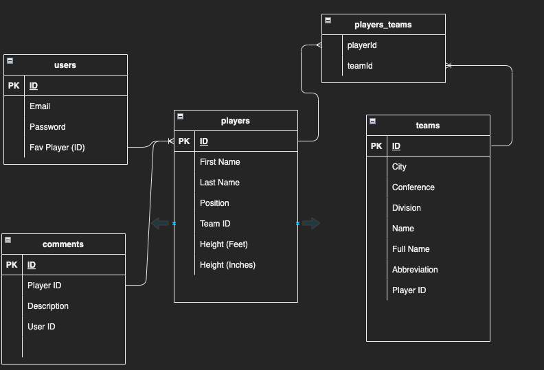
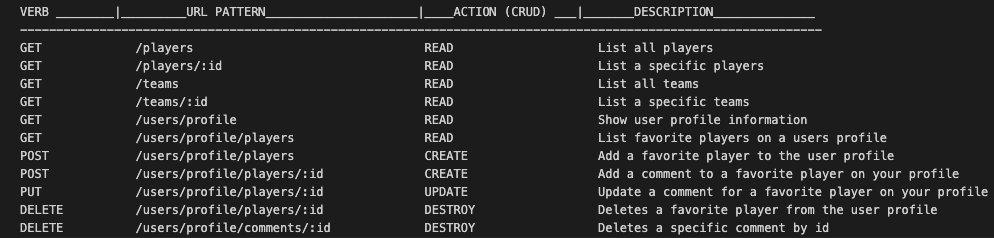

# NBA APP
I will be creating an NBA app. Users will have unique logins with authorization processes in place for security. Users will be able to search for players/teams and save favorite players to their account. Add comments to your favorite players (perhaps you'd like to predict a potential MVP/breakout player or post a fond memory of said player). Find details about players and teams to learn more about the game of basketball within the NBA API!

---

## TECHSTACK:
* JavaScript
* Node
* Express
* Axios
* Sequelize
* EJS
* Express-EJS-Layouts
* PostgreSQL
* HTML
* CSS

---

## USER STORY:
* As a user, I want to be able to see details on players/teams to help understand the NBA.
* As a user, I want to create favorite players to post to my profile.
* As a user, I want to create comments to post on my profile's favorite players.
* As a user, I want to edit/delete comments from my favorite players on my profile.

---

## MVP:
* Display information about players/teams that the user can search through.
* Allow users to 'favorite' players to save to their profile for quick access to their details page
* Allow users to add comments to their profile's favorite players

---

## STRETCH GOALS:
* Include images for teams (array of 30 images)
* Images for players (lots of players -- may have to find an api with existing images)
* Include player stats (unsure if this is something that needs to be decided on now or can be implemented later)

---

## ERD

---

## RESTFUL ROUTES

---

## RESOURCES:
* [balldontlie API](https://www.balldontlie.io)

---

## POST-PROJECT REFLECTION
* My initial plan was to use either the most recent completed season, or the upcoming season to base my project on. After digging deeper into the API, I found that there was no way to filter in this manner, and it included the entire history of players in the NBA.
*  I pivoted to make my project more player/team detail oriented rather than stat oriented. A benefit to this change is that a fan of any era can use the app to revisit their favorite players and record their thoughts.
* I learned how important the planning phase of the project was, and to expect the unexpected.
* Styling has always been a weak area of mine, and while I didn't get it to visually match my vision, I certainly learned a lot of useful new ways to approach the styling aspect of an app.